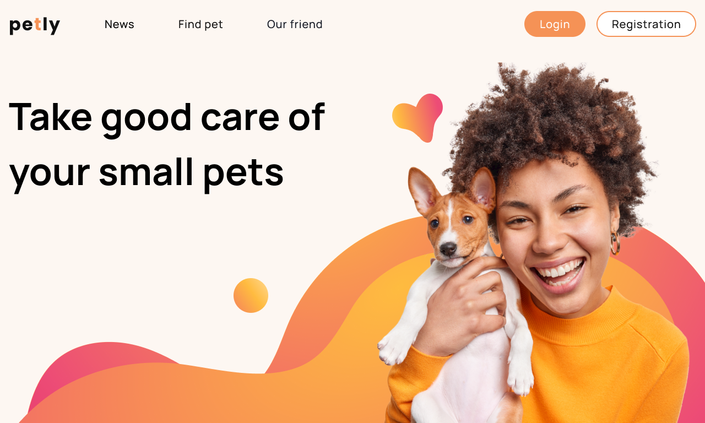
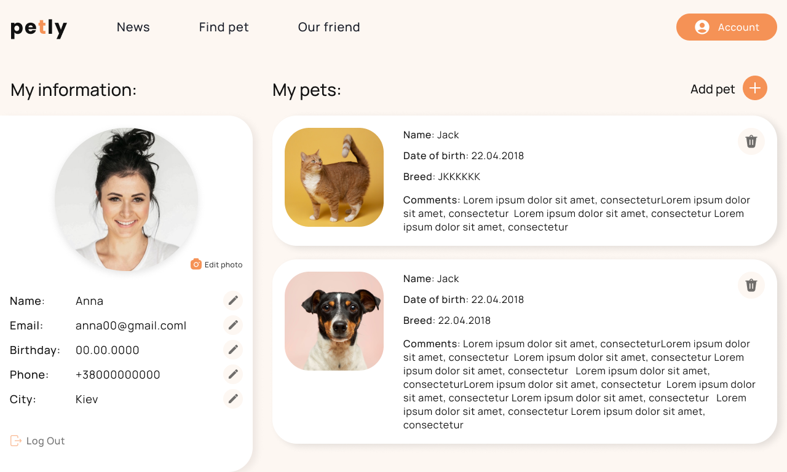
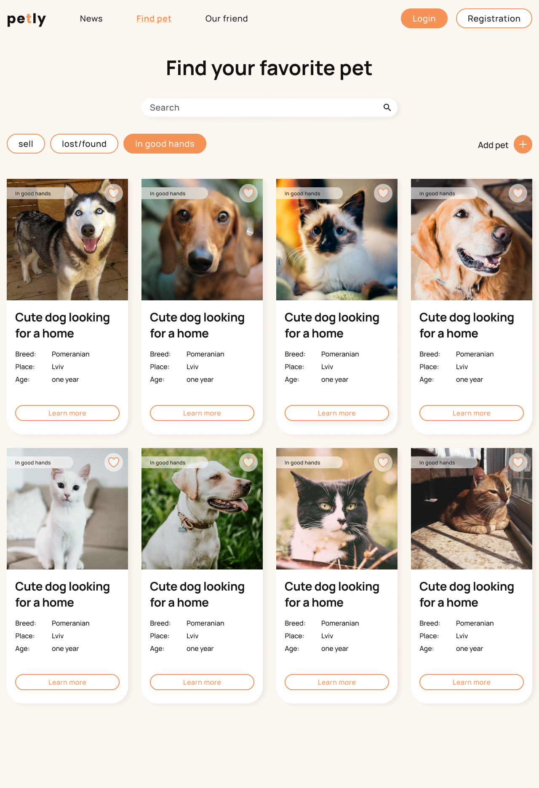

# Project to help pets find an owner

## This project was created by:

- **[Serhii Onyshchenko](https://github.com/SerhiiOnyshchenko)** -Role:Team
  Lead;

- **[Elena Shmetan](https://github.com/shmetanelena)** - Role:Scrum Master;

- **[Kiziev Dmitriy](https://github.com/KizievDmitriy)** - Role:Front End
  Developer;

- **[Natalia Monasturska](https://github.com/NataliaMonasturska)** - Role:Full
  Stack Developer;

- **[Yaroslav Vyshynskyi](https://github.com/YaroslavVyshynskyi)** - Role:Full
  Stack Developer;

- **[Kashyrets Ivanna](https://github.com/KashyretsIvanna)** - Role:Full Stack
  Developer;

- **[Dmytro Mykhailov](https://github.com/imavin08)** - Role:Back End Developer;

- **[Alex Borets](https://github.com/alex-borets)** - Role:Front End Developer;

- **[Illia Bekarevych](https://github.com/IlliaBekarevych)** - Role:Front End
  Developer;

- **[Ihor Sharkadi](https://github.com/ihorshark)** - Role:Front End Developer;

- **[Gudyma Vitaliy](https://github.com/GudymaVit)** - Role:Front End Developer;

- **[Martinyk Natalia](https://github.com/Natalia2715)** - Role:Front End
  Developer;

- **[Zoryana Fedorovska](https://github.com/zfedorovska)** - Role:Front End
  Developer;
- **[Andrii Krupa](https://github.com/andrii248)**- Role:Front End Developer;

## Trello with command tasks:

[link](https://trello.com/b/AQFNc03c/petly)

### Time for work

15 days

### Live page

[link](https://serhiionyshchenko.github.io/react-node-team-project/)

### Back End

[link](https://github.com/SerhiiOnyshchenko/react-node-team-project-backend)

### Swagger

[link](https://team-project-backend.onrender.com/api/docs/)

## Как это работает
